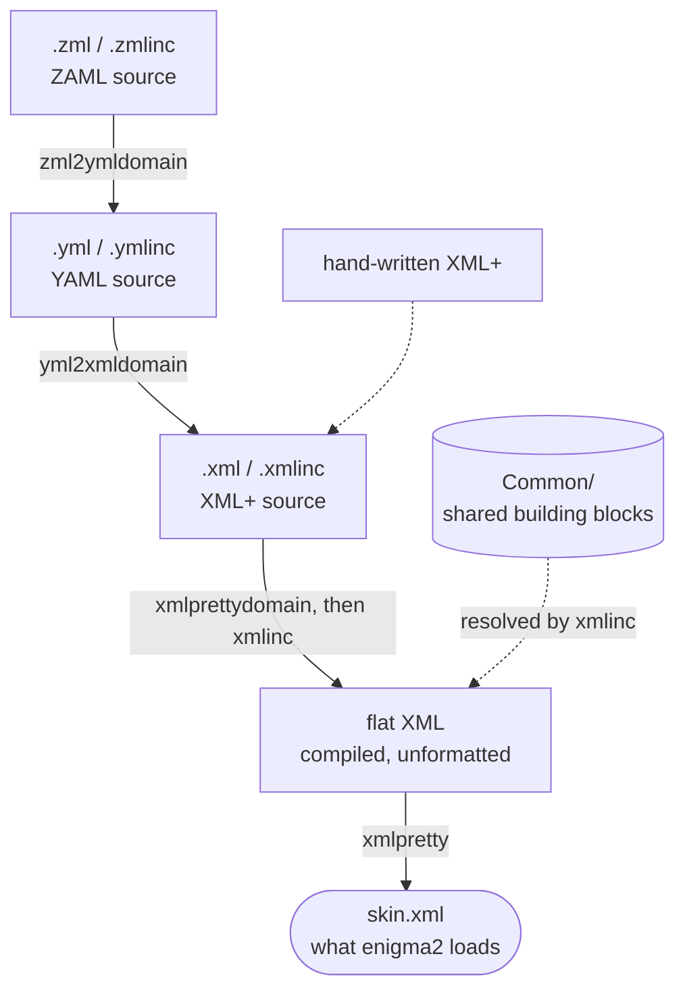
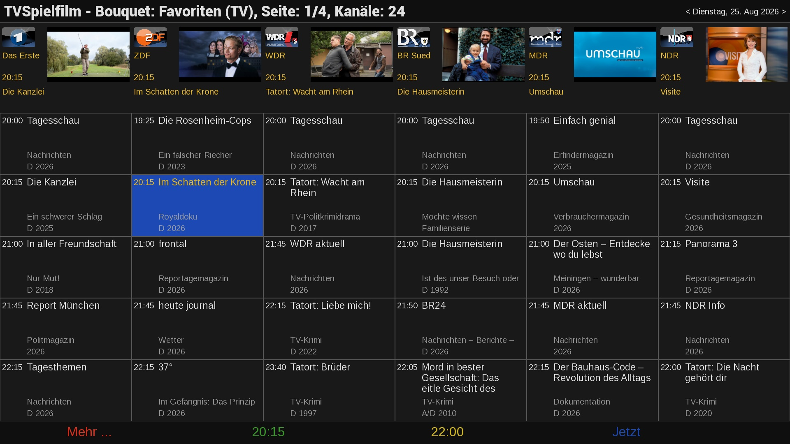

# SkinForge - Next generation Enigma2 skin design with ZAML/YAML language

## Introduction
An enigma2 skin is natively just a flat XML file: no includes, no macros, no relative positioning, no variables, no reuse. If you maintain more than one plugin and want a consistent look — or want to change a button style in one place instead of in every `skin.xml` that copy-pasted it — you're stuck hand-editing pixel coordinates in N files at once.

Modern enigma2 distributions add some more advanced features like includes, templates, panels. But those only provide limited support for hierarchical design with reusable building blocks. As those skin elements are rendered directly on the box on the fly, those shortcomings were probably required due to limited box processing power. This can be avoided by using an offline skin compiler.

SkinForge doesn't change what enigma2 itself understands — it compiles a richer source down to the plain, flat XML enigma2 actually loads. There are 3 levels of languages on top of XML that simplify skin design:

These are the implemented language hierarchy levels:

0. **XML** — the original flat XML language enigma2 itself understands; nothing to compile since it already is the target format.
1. **XML+** — the enhanced hierarchical XML dialect (includes, variables, relative positioning, compile-time color/formula checking) compiled end-to-end to XML with `xmlcompile`.
2. **YAML** — A readable YAML dialect (`skin.yml` / `*.ymlinc`) that losslessly round-trips to/from XML+, compiled end-to-end with `ymlcompile`. Editors like Notepad++ allow to edit YAML sources conveniently.
3. **ZAML** (Zenith Advanced Markup Language) — an optional thin layer on top of YAML that adds a `for` loop, for the common case of a screen repeating the same block N times with an index (see [ZAML: Loops on top of YAML](#zaml-zenith-advanced-markup-language-loops-on-top-of-yaml)). Its source expands to plain YAML before anything else runs, compiled end-to-end with `zmlcompile`.

The latter three (XML+, YAML, ZAML) share the same compiler and the same `Common` directory of reusable building blocks (buttons, title bars, colors, ...) — ZAML expands to YAML, which is simply converted to XML+, then compiled the same way.



## ZAML & YAML skin example

The following ZAML & YAML screen sources describe this screen:



### ZAML skin definition

Note: The ZAML description uses for loops to define 2 x 6 repeating widgets.

```yaml
screen:
  backgroundColor: "panelBG"
  flags: "wfNoBorder"
  name: "TVMagazineCockpit"
  position: "center,center"
  resolution: "1920,1080"
  size: "1920,1080"
  children:
    - xmlinc:
        file: "screenpart_TitleBar.ymlinc"
    - widget:
        font: "$FR_verysmall"
        halign: "right"
        name: "day_selector"
        position: "1490,15"
        size: "420,26"
        transparent: "1"
        valign: "center"
        zPosition: "2"
    - for:
        var: "$i"
        range: [0, 5]
        body:
          - xmlinc:
              file: "screenpart_PrimeCell.ymlinc"
              index: "$i"
              position: "$i*$screen_width/6,0"
    - for:
        var: "$i"
        range: [0, 5]
        body:
          - widget:
              backgroundColorSelected: "keyBlue"
              enableWrapAround: "1"
              position: "eval($i*320),275"
              render: "Listbox"
              scrollbarMode: "showNever"
              size: "320,750"
              source: "list$i"
              transparent: "1"
              children:
                - xmlinc:
                    file: "screenpart_EventCell.ymlinc"
    - xmlinc:
        file: "screenpart_Footer.ymlinc"
```

### YAML skin definition

Note: Only the first and last of the 2 x 6 repeating widgets are shown in the YAML description.

```yaml
screen:
  backgroundColor: "panelBG"
  flags: "wfNoBorder"
  name: "TVMagazineCockpit"
  position: "center,center"
  resolution: "1920,1080"
  size: "1920,1080"
  children:

    # title bar
    - xmlinc:
        file: "screenpart_TitleBar.ymlinc"

     # day selector
    - widget:
        font: "$FR_verysmall"
        halign: "right"
        name: "day_selector"
        position: "1490,15"
        size: "420,26"
        transparent: "1"
        valign: "center"
        zPosition: "2"

    # 6 identical screen parts showing the prime time information
    - xmlinc:
        file: "screenpart_PrimeCell.ymlinc"
        index: "0"
        position: "0*$screen_width/6,0"

    ...

    - xmlinc:
        file: "screenpart_PrimeCell.ymlinc"
        index: "5"
        position: "5*$screen_width/6,0"

    # 6 identical event lists
    - widget:
        backgroundColorSelected: "keyBlue"
        enableWrapAround: "1"
        position: "0,275"
        render: "Listbox"
        scrollbarMode: "showNever"
        size: "320,750"
        source: "list0"
        transparent: "1"
        children:
          - xmlinc:
              file: "screenpart_EventCell.ymlinc"

    ...

    - widget:
        backgroundColorSelected: "keyBlue"
        enableWrapAround: "1"
        position: "1600,275"
        render: "Listbox"
        scrollbarMode: "showNever"
        size: "320,750"
        source: "list5"
        transparent: "1"
        children:
          - xmlinc:
              file: "screenpart_EventCell.ymlinc"

    # button bar
    - xmlinc:
        file: "screenpart_ButtonBar.ymlinc"
        position: "0,$screen_height-48"
```

## Quick start

```
zmlcompile <domain> [srcbase] [dstbase] [cmnbase]
```

`<domain>` is the plugin's directory name. 

The base-path arguments are optional and independently default to `$HOME/git/dev`, `$HOME/git/rel`, and `$HOME/git/Common` — pass them to build against a different checkout (e.g. a worktree) without touching `$HOME/git`:
`srcbase` roots the plugin's own source,
`dstbase` the destination tree, and 
`cmnbase` the shared `Common` tree.

## Authoring in YAML

Skin sources are written as YAML — a `skin.yml` (a full document) or a `*.ymlinc` (an include fragment, the YAML equivalent of `.xmlinc`) — and converted to and from plain XML+ by `yml2xml`/`xml2yml` (the single-file tools `ymlcompile` drives via `yml2xmldomain`/`xml2ymldomain`).

### Usage

```
yml2xml <source .yml/.ymlinc file> <destination .xml/.xmlinc file>   # YAML -> XML+, feed the result to xmlinc
xml2yml <source .xml/.xmlinc file> <destination .yml/.ymlinc file>   # XML+ -> YAML, the reverse
```

### Mapping

- An element `<tag attr="val">...children...</tag>` becomes `{tag: {attr: "val", ..., children: [...]}}`.
- A standalone `<!-- comment -->` before a child element becomes a standalone `# comment` right before the matching list item (and back).
- A document with more than one top-level element — a real possibility for a `.xmlinc` *fragment* (spliced into a parent by literal text substitution, so it isn't required to have a single root the way a real XML document is) — becomes a top-level `- tag: {...}` dash list instead of the usual single `tag: {...}` mapping, the same shape a `children:` list already uses:
  ```yaml
  - eLabel: {backgroundColor: "separator", position: "0,e-56", size: "e,2"}
  - eLabel: {backgroundColor: "barBG", position: "0,e-55", size: "e,55"}
  ```
  A single-root document (by far the common case) keeps the plain `tag: {...}` form unchanged.

### The `<convert>` template special case

A `<convert type="...">` block holding a `TemplatedMultiContent`/`TemplatedMultiContentEx` template is a Python dict literal, not markup — `RT_*`/`BT_*` flag algebra, `MultiContentEntry*` call names, and numeric font indices. Rather than mirroring that syntax 1:1, it's translated into a domain-level `cell:` describing what's actually shown in each row:

```yaml
cell:
  itemHeight: 150
  fonts:
    - "Regular;32"
    - "Regular;20"
  border: {width: 1, color: 0x595959, font: "Regular;20", flags: RT_VALIGN_CENTER}
  fields:
    - text:
        position: "5,5"              # pos=/size= kept as the same "x,y" strings every other widget's position=/size= use
        size: "55,25"
        font: "Regular;20"          # resolved from the fonts index, same font="..." syntax every other widget uses
        flags: RT_HALIGN_LEFT | RT_VALIGN_CENTER
        value: 0                    # renamed from text= - still the raw tuple index, see note below
    - icon:
        position: "0,5"
        size: "35,35"
        flags: BT_SCALE
        value: 23                   # renamed from png=
    - progress:
        position: "90,5"
        size: "90,14"
        value: -22                  # renamed from percent=
        foreColor: "#bababa"
```

- **Three field kinds cover every real template in this codebase**: `text` (from `MultiContentEntryText`), `icon` (from `MultiContentEntryPixmapAlphaBlend`, or `MultiContentEntryPixmapAlphaTest` — marked with a `variant: "AlphaTest"` key, omitted for the far more common Blend case), `progress` (from `MultiContentEntryProgress`) — each only when the call has exactly the plain kwarg set observed in practice. Anything else (`Rectangle`, `LinearGradient*`, `ProgressPixmap`, or a call with an unusual extra kwarg like `cornerRadius`) falls back to a `raw` field carrying the untouched `{call, args?, kwargs?}` shape described below — never lossy, it just doesn't get the readability upgrade. A `text` field's `font:` is itself optional — some plugins omit `font=` and let enigma2 default it, and that's preserved as an absent key rather than forced to a guessed value.
- **`cell.fonts` is the source template's `"fonts"` list, kept verbatim, same order, same positions** — not deduplicated or renumbered, and never dropped, even for an entry no `font=N` anywhere in the template currently points to. `font=N` is a positional reference something outside this one `<convert>` block may rely on, so round-tripping must never renumber or delete a slot just because nothing here currently uses it. A plain two-arg `gFont(family, size)` entry renders as the same `"Family;Size"` string every `font:` reference elsewhere uses (as above); anything else (e.g. `parseFont(...)`) falls back to the verbose `{call, args}` form, still inside `fonts:`.
- **`cell.vars` covers `TemplatedMultiContentEx`'s local-variable feature** — some plugins declare a `"var": (name := expr, ...)` tuple of walrus-bound values ahead of `"template"` and reference them throughout its `pos=`/`size=` expressions (grid math shared across several rows/columns, computed once). Preserved as an ordered list of the exact binding text, since order matters (a later binding can reference an earlier one by name) and the right-hand side is an arbitrary Python expression, not typed data. Each entry accepts either `name := expr` or the more natural-looking `name = expr` — always compiled back out as `:=`, the only valid syntax inside the `"var": (...)` tuple literal itself:

  ```yaml
  cell:
    vars:
      - "ih = 70"
      - "hspace = 10"
      - "x1 = hspace//2+thumb_w+hspace"
    fields:
      - icon:
          position: "hspace//2,(ih-thumb_h)//2"   # position:/size: freely mix var names, literals, and grid math
          size: "thumb_w,thumb_h"
          ...
  ```

- **`MultiContentTemplateColor(n)` still nests inside a color-ish key** exactly as before: `color: {call: MultiContentTemplateColor, args: [24]}`.
- **Not in scope**: resolving `value: 0` to a semantic name (`value: startHM`) — that needs a per-plugin tuple-index mapping (e.g. a screen's own `Index.py`) this tool has no generic way to discover, so `value:` stays the raw index/literal, same information as `text=`/`png=`/`percent=` always held.

- **Every entry factory is covered the same generic way** — `Text`, `Pixmap`, `PixmapAlphaTest`, `PixmapAlphaBlend`, `Progress`, `ProgressPixmap`, `Rectangle`, `LinearGradient`, `LinearGradientAlphaBlend` (the complete list in `Components/MultiContent.py`) — the `call` name is just emitted as-is.
- **`TemplatedMultiContentEx`'s `e`/`c` grid variables work in `pos=`/`size=` arithmetic** (and inside a domain field's `position:`/`size:`): `position: "e-350,15"`.
- **Kwarg values are quoted strings by default** (real Python string literals) — *except* `flags`, `call`, and `direction`, the three keys that hold code (`RT_*`/`BT_*`/`GRADIENT_*` constants, a callable name) rather than data. This is decided by key name, not by how the value was written: YAML's own parser can't tell a quoted string from a bare one apart once parsed, so quoting style alone can't carry the distinction through a round trip.

### Formatting conventions

`yml2xml`, `xml2yml`, and `xmlpretty` all independently enforce the same conventions on a `<convert>` block's Python-source body, so a file generated by one and reformatted by another never disagrees with itself:

- `pos=(x,y)`/`size=(w,h)` tuples, `gFont(family,size)` calls, and `flags` OR-chains (`A|B`) stay **tight** — no space after the comma or around `|` — even though every other comma (between kwargs, between list items) does get a space. This matches how these are overwhelmingly hand-written across the real plugins in this codebase.
- Strings always use `"`, never `'`.
- `"key": value` object pairs (`itemHeight`, `fonts`, ...) always have a space after the colon.
- A raw-preserved convert body (one `parseConvertTemplate` doesn't recognize the shape of, e.g. a plugin-specific type with extra top-level keys) still gets its outer indentation normalized — the opening `{`/closing `}` line up with the `<convert>` tag itself, one level deeper for its own keys — without touching a single character of content it doesn't understand.

## Authoring in ZAML (Zenith Advanced Markup Language): Loops on top of YAML

The YAML dialect above still has no way to say "repeat this six times" — the `screenpart_PrimeCell`/`screenpart_EventCell` blocks in the [YAML skin example](#yaml-skin-example) are unrolled by hand, one list item per index. ZAML adds exactly one construct on top of YAML to remove that repetition: a `for` loop. Nothing else changes — a `.zml`/`.zmlinc` file is ordinary SkinForge YAML with `for` items sprinkled in, and `zml2yml` expands every one of them into plain YAML before `yml2xml`/`xmlinc` ever see the file.

### Syntax

```yaml
- for:
    var: "$i"
    range: [0, 5]
    body:
      - xmlinc:
          file: "screenpart_PrimeCell.ymlinc"
          index: "$i"
          position: "$i*$screen_width/6,0"
```

`var` names the token exactly as it appears in `body` — `"$i"`, dollar sign included — rather than a separate bare name you'd have to mentally re-prefix each time; what you declare is what you'll see used below it (a bare `var: i` without the `$`/quotes still works too, for anything written before this convention). `range: [start, end]` is inclusive, so `[0, 5]` runs six times. `body` is a list, expanded once per iteration and spliced in place of the single `for` item, in order. Inside each copy, every occurrence of `$i` in a string value is replaced by that iteration's plain integer — the same "a `$var` can be embedded inside a literal" rule `xmlinc` itself uses for `$vars` (e.g. `list$i`, `$i*$screen_width/6,0`), not a new substitution mechanism. Nesting a `for` inside another `for`'s `body` works: the outer loop's copies still contain an unexpanded inner `for`, which `zml2yml` expands on its next pass over the file.

A `for` item missing `var`, `range`, or `body` is left untouched in the output rather than silently dropped — `yml2xml`/`xmlinc` don't understand a `for:` key, so a malformed loop fails loudly downstream instead of quietly disappearing.

### Usage

```
zmlcompile <domain> [srcbase] [dstbase] [cmnbase]
```
Same signature as `ymlcompile` (see [Quick start](#quick-start)). It expands any changed `*.zmlinc` source — in both the plugin's own tree and the shared `Common` tree — to `.yml`/`.ymlinc` via `zml2ymldomain`, then hands off to `ymlcompile` for the rest. `zml2ymldomain` is the per-domain building block it calls, taking `<domain-or-.> [skin] [base]` like `yml2xmldomain` does; use `zml2yml.py -i <file>` directly to expand a single file in isolation.

## The foundation: XML+ compiler (`xmlinc`)

`xmlinc` reads a skin source file that mixes ordinary enigma2 XML with a small set of extra constructs, resolves all of it, and writes out a single plain XML file with nothing left in it that enigma2 wouldn't understand natively.

### What it resolves

- **Hierarchical includes** — `<xmlinc file="name" .../>` pulls in `name.xmlinc` (or any file with an explicit extension) in place, recursively. Included files are searched in order next to the source file, in its parent directory, in a shared "common" directory, and in that common directory's parent — so a plugin can override a shared building block just by placing a same-named file closer to its own skin.
- **Parameters on includes, as `$vars`** — every extra attribute on an `<xmlinc>` tag becomes a `$name` variable visible inside the included file (`size=` additionally exposes `$width`/`$height`). This is what makes an include reusable rather than a copy-paste target:

  ```xml
  <!-- Example.xml -->
  <xmlinc file="test" source="title"/>
  ```
  ```xml
  <!-- test.xmlinc -->
  <widget ... source=$source .../>
  ```
  compiles to:
  ```xml
  <widget ... source="title" .../>
  ```

- **Relative positioning** — a `position="x,y"` attribute on an `<xmlinc>` tag is added to every widget position inside that include, recursively through nested includes. A shared `buttons.xmlinc` block of four pixmaps at `0,0` / `300,0` / `600,0` / `900,0` becomes a single reusable "button bar" you place anywhere just by choosing where to `<xmlinc>` it:

  ```xml
  <xmlinc file="buttons" position="100,200"/>
  ```
 
  places the first button at `100,200`, the second at `400,200`, and so on.
- **An include's own size is exposed back to its parent** — every `<xmlinc>` sets `$child_width`/`$child_height` to the bounding box (furthest right/bottom edge) of the content it just pulled in, measured in that file's own local 0,0-based coordinates, once its content is fully processed but *before* its own `position=` is resolved — so the include can reference its own just-measured size to place itself, with nothing hand-computed or hardcoded:

  ```xml
  <xmlinc file="screenpart_PRSPluginBody.xmlinc" position="eval(($screen_width-$child_width)/2),150"/>
  ```

  centers that include horizontally, whatever width its content actually adds up to. The name is fixed, not per-file, so each `<xmlinc>` overwrites it — only reliable for the include that was *just* processed (this one, on its own `position=`, or the very next thing after it), not an earlier sibling.
- **Global variables** — `<global name="x" value="y"/>` defines `$x`; `<screen size="w,h" .../>` implicitly defines `$screen_width`/`$screen_height` for the whole file. `$vars` don't need to be their own token — `picon$index` substitutes just the `$index` part, so variables can be embedded in literals.
- **Colors, checked at compile time** — any `...Color="name"` attribute is validated against colors declared via `<color name="x" value="y"/>` (normally collected from a shared `screenpart_colors.xmlinc`)
- **Per-tag defaults** — `<default tag="widget" zPosition="1" transparent="1" .../>` (normally collected from a shared `screenpart_defaults.xmlinc`, the same way colors are) fills in any attribute a `widget` element doesn't set itself; an attribute the element *does* set always wins. This is for a uniform look across plugins — change a value in one shared file instead of on every widget in every screen. `tag` can optionally be narrowed to one `render` variant, e.g. `<default tag="widget[render=Label]" font="$FB_medium"/>` only fills widgets whose own `render="Label"` — since a plain `tag="widget"` block otherwise applies to every widget regardless of what it renders (Label, Pixmap, ProgressBar, ...). A render-specific block and a plain `tag="widget"` block can coexist: for a given attribute, the render-specific one wins if it sets that attribute, the plain one fills anything still unset, and the element's own attributes always win over both. Defaults are matched by tag name (plus optional `render`) only — no per-screen targeting — and, like colors, only take effect once the file declaring them has actually been reached via an `<xmlinc>` include — conventionally near the top of `skin.yml`/`skin.xml`, alongside `screenpart_colors`/`screenpart_fonts`. A `<default>` element itself never appears in the compiled output.
- **Formula evaluation** — `eval(...)` runs the enclosed expression as real arithmetic, so positions and sizes can be computed instead of hand-calculated: `eval(($width-100)/2)` centers a 100px-wide element. Division is automatically treated as integer (floor) division since pixel coordinates can't be fractional; if a formula still produces a float (e.g. from a scaling ratio) the result is rounded to the nearest pixel rather than truncated.
- **Font/size sanity check** — every widget with both a `font` and a `size` is checked against a minimum-line-height heuristic; a `size` too short for its `font` produces a warning identifying the screen, widget, font variable, and both values, catching text that would otherwise render clipped on the actual device.
- **Verbatim passthrough** — an include named `applet_*` is inlined as raw text without any of the above processing, for embedding pre-rendered or foreign XML snippets unchanged.

### Usage

```
xmlinc <source-file> <destination-file> <destination-dir> <common-dir>
```

- `source-file` — the hierarchical skin source (e.g. `skin.xml`, or a screen's own `.xml`)
- `destination-file` — where the fully-resolved, flat XML is written
- `destination-dir` — the directory `xmlinc` treats as the plugin's own skin directory when searching for includes
- `common-dir` — a shared directory of reusable `.xmlinc` building blocks (buttons, title bars, colors, ...) used across plugins

`xmlcompile`/`ymlcompile` call this per skin variant as part of a full build; run it directly only when working on a single file in isolation.

## Other tools

Everything below operates on already-flat XML (or SVG) and doesn't involve the `xmlinc` include/variable/formula language.

| Tool | Usage | Purpose |
|---|---|---|
| `xmlscale` | `xmlscale <scaling factor> <source file> [destination file]` | Scale every position/size in an XML file by a factor (defaults to overwriting the source) |
| `xmlmerge` | `xmlmerge <source file 1> <source file 2> <destination file>` | Merge two XML files into one |
| `xmlpretty` | `xmlpretty [source file/dir] [destination file/dir]` | Check an XML file for well-formedness and reformat it, including plugin-specific normalization of a `<convert>` block's Python-source body (see [Formatting conventions](#formatting-conventions)); defaults to the current directory for both source and destination |
| `xmlsplit` | `xmlsplit <input file>` | Split a combined XML file into its screen parts |
| `svgscale` | `svgscale <scaling factor> <svg file> <destination file>` | Scale a single SVG (PC only — `librsvg2-bin` isn't available on the box) |
| `svgscaledir` | `svgscaledir <scaling factor> <directory>` | Scale every SVG under a directory, recursively |

## Installation
Just clone the repo and add the git dir to the PATH variable:

```
git clone git@github.com:xcentaurix/SkinForge.git
```

## Limitations
- Tested on OpenViX and OpenATV with DM900.
